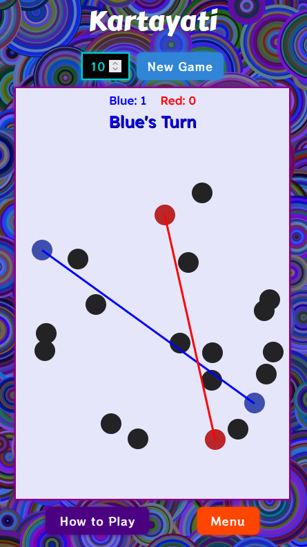
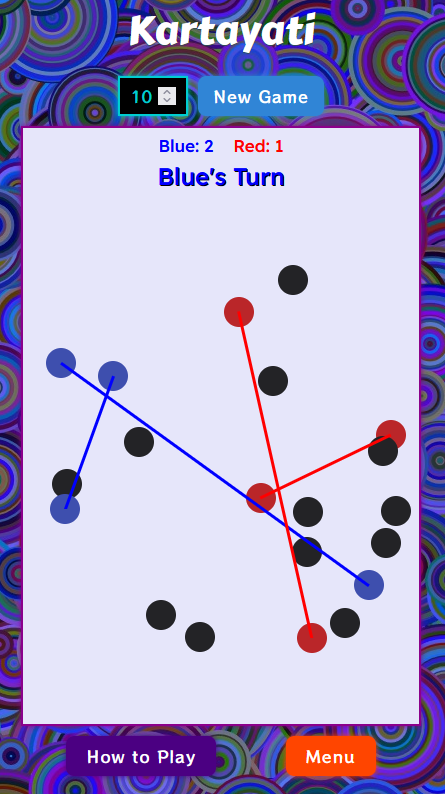
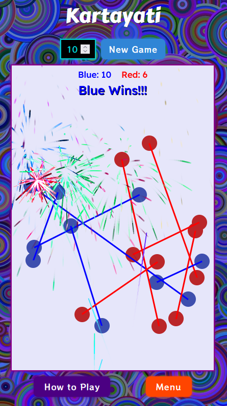
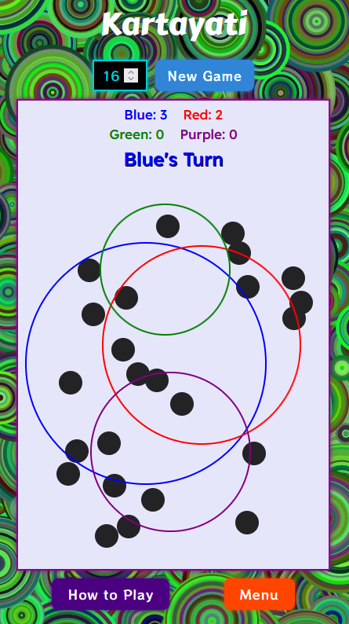
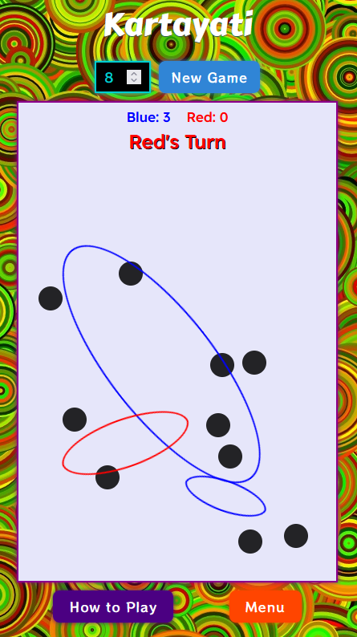
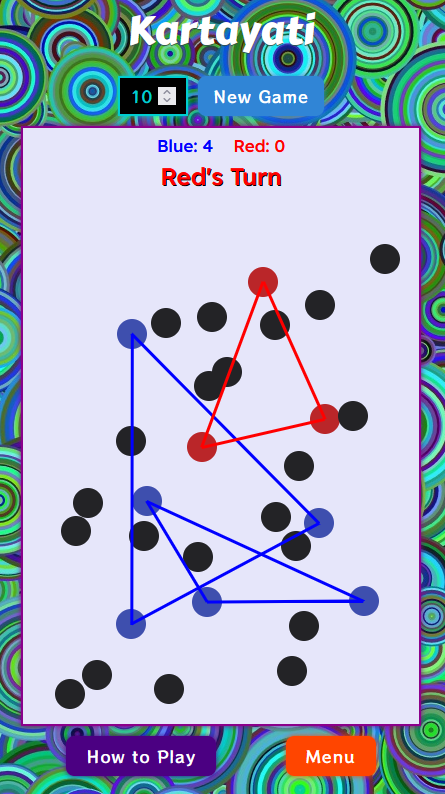

  

  <em>A minimalistic yet strategic PWA game built with Next.js and pure JavaScript.</em>

  
  

---

## ⚙️ Technical Details

- **Framework:** Next.js (React-based)
- **Languages:** JavaScript, CSS
- **Progressive Web App:** Installable, optimized for mobile touch usage
- **External Libraries:**
    - [Fireworks-js](https://github.com/crashmax-dev/fireworks-js) – Author: crashmax, MIT License
    - [SweetAlert2](https://sweetalert2.github.io/) – MIT License
    - [Next-PWA](https://github.com/shadowwalker/next-pwa) - MIT License
- 💡 **Fonts:** No cookies are required due to the use of preinstalled Google Fonts — no cookie consent screen required.

---

## 🕹️ About the Game

**Kartayati (vikṛt विकृत्)**

- Sanskrit: *kṛntati* – “to cut into or through, divide by cutting”
- Casual: *kartayati*

🙏 The original game concept was developed by **Prof. Dr. Andreas Faatz** as a two-player lines game based on a fixed set of dots.

The current version of **Kartayati** builds on that foundation and expands the original concept in several ways.
The new features — including a selectable player count (2–4 players), adjustable maximum number of lines, circles, ellipses, or triangles, and automatic placement of dots based on that logic — were developed by **Paul-Gerhard Siegel**.

The **Circles mode** was based on an idea suggested by Prof. Faatz following the development of the **Ellipses mode**, while its implementation and underlying logic were fully developed by Siegel.

The entire application was programmed from the ground up in **JavaScript** and designed as a **Progressive Web App** optimized for touch interfaces. The overall design, gameplay mechanics, and user experience of this version were independently realized by Siegel, with Prof. Faatz providing early conceptual input and inspiration during the project’s development.

---

## 🎮 Gameplay

Kartayati is played on a field filled with evenly spaced dots. Two players take turns connecting any two dots with a straight line — Player One uses blue lines, Player Two uses red lines.

Points are scored whenever lines cross:

- **Crossing your own lines** gives your color +1 point.
- **Crossing your opponent’s lines** gives **them** +1 point.

This creates a strategic balance:

1. **Maximize your own points** by crossing your existing lines.
2. **Challenge your opponent** by placing lines in ways that force them to cross your lines.
3. Avoid crossing your opponent’s lines, as that gives them points.

The winner is the player with the **highest total points** at the end of the game.

💡 *Kartayati combines spatial reasoning and tactical planning, rewarding players who can balance offense and defense simultaneously.*

---

## 🚀 Versions and Development

- **Lines Mode:** Fully functional; the classic gameplay described above.
- **Circles Mode:** Instead of lines, circles are created. Fully functional.
- **Ellipses Mode:** Instead of lines, ellipses are created. The overlap algorithm is currently resource-intensive and prone to errors. A new, more efficient algorithm is in development and will be added to the repo once completed.
- **Triangles Mode:** 🚧 In development.

---

## 🔗 Live Version

**[Play Kartayati Online](https://kartayati.netlify.app/)**

---

## 🖼️ Screenshots

- Classic Gameplay showing progression between turns of two players.
- The number of Lines a game should start with can be input into the number field next to the **New Game** Button

|  |  |  |
|----------------------------------------------------------|----------------------------------------------------------|----------------------------------------------------------|

- Below are Screenshots of the other Game Modes
- In Circles and Ellipses Mode the selected dots disappear after the creation of the circle or Ellipse. 
- The Triangle Mode Screenshot shows a prerelease version, subject to changes. 

| Circles Mode                                                                                   | Ellipses Mode                                                                                      | Triangles Mode (pre release)                                                                   |
|------------------------------------------------------------------------------------------------|----------------------------------------------------------------------------------------------------|------------------------------------------------------------------------------------------------|
|  |  |  |

---

## 🧑‍💻 Author & Contact
| Name                | Contact                                                                                                                                                                |
|:--------------------|:-----------------------------------------------------------------------------------------------------------------------------------------------------------------------|
| Paul-Gerhard Siegel | [GitHub](https://github.com/pgs3238) · [LinkedIn](https://www.linkedin.com/in/paul-gerhard-siegel-719a4512/) · [Xing](https://www.xing.com/profile/PaulGerhard_Siegel) |